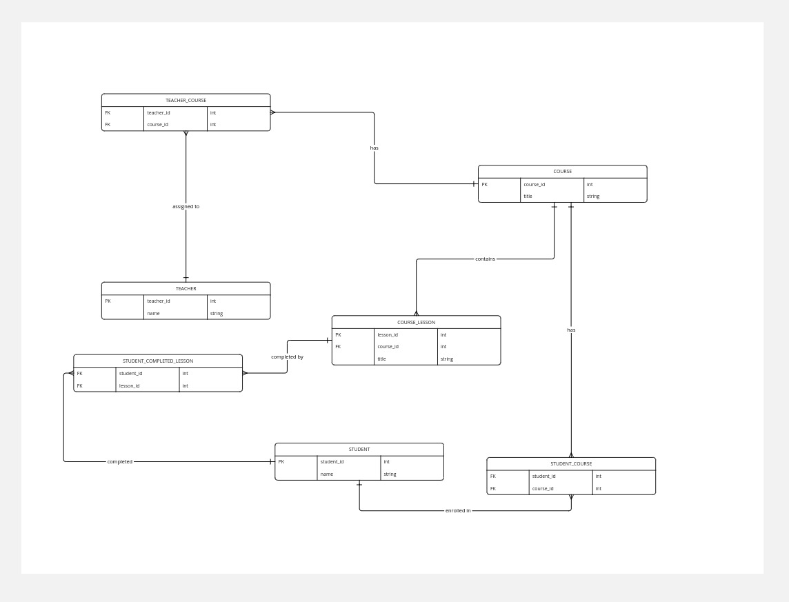

# SQL Task

## ERD (Used [miro.com](https://miro.com/))




## Files explained:

- **Task queries (directory)**: contains main 3 task queries
- **system_init.sql**: contains SQL commands for creating necessary database/role/permissions
- **enitites_create.sql**: contains SQL commands for creating necessary tables
- **data_seeds.sql**: contains data fixtures with many cases
- **execute.sh**: will be explained in the next section


## How it works

There is a bash script file `./execute.sh` which takes some parameters:

    query_file.sql database_name username password [optional flag to use existing data]

This file executes the query_file based on the other parameters and makes sure that all tables are created

## If you are running for the first time:

  - make sure to have a `postgres` user
  - run `./execute.sh data_seeds.sql db_name username password` which adds data fixtures
  - run `./execute.sh query_file db_name username password` where task queries are [Here](https://github.com/ashrafemad/general_coding_task/tree/main/sql/task_queries)

## Later:

  just run 
      `./execute.sh query_file db_name username password yes` directly, note the added `yes` to bypass the creation process and head to query execution

## To reset:
  
  run `./execute.sh data_seeds.sql db_name username password`

## Why it was built like this:

  1- reduce setup steps for the user
  
  2- provide ready fixtures

  3- making the app as standalone as possible


  ## Example output:
  
  1- Retrieve all students enrolled in a given course, assuming the course is `Physics 101`:
  
  ```
student_id |   name   
------------+----------
          1 | John Doe
          2 | Jane Doe
  ```
  
  2- Get the progress of each student per course based on lesson completion:

```
    student    |     course      | completed | total | percentage 
---------------+-----------------+-----------+-------+------------
 John Doe      | Mathematics 101 |         2 |     3 |      66.67
 John Doe      | Physics 101     |         0 |     2 |       0.00
 John Doe      | Chemistry 101   |         0 |     2 |       0.00
 John Doe      | Chemistry 102   |         0 |     2 |       0.00
 Jane Doe      | Physics 101     |         1 |     2 |      50.00
 Michael Brown | History of Art  |         1 |     2 |      50.00
 Michael Brown | Biology 101     |         1 |     3 |      33.33
 Emily White   | Biology 101     |         1 |     3 |      33.33
 Chris Black   | Chemistry 101   |         1 |     2 |      50.00
```

3- Retrieve the courses a teacher is assigned to:
```
       name        |                   courses                   
-------------------+---------------------------------------------
 Dr. Alice Johnson | Mathematics 101, Chemistry 101, Physics 101
 Dr. Charlie White | History of Art
 Dr. Emma Green    | Biology 101
 Prof. Bob Smith   | Physics 101
```
  
